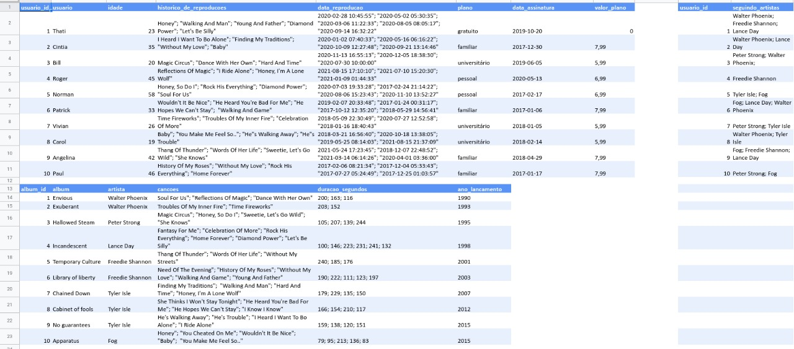
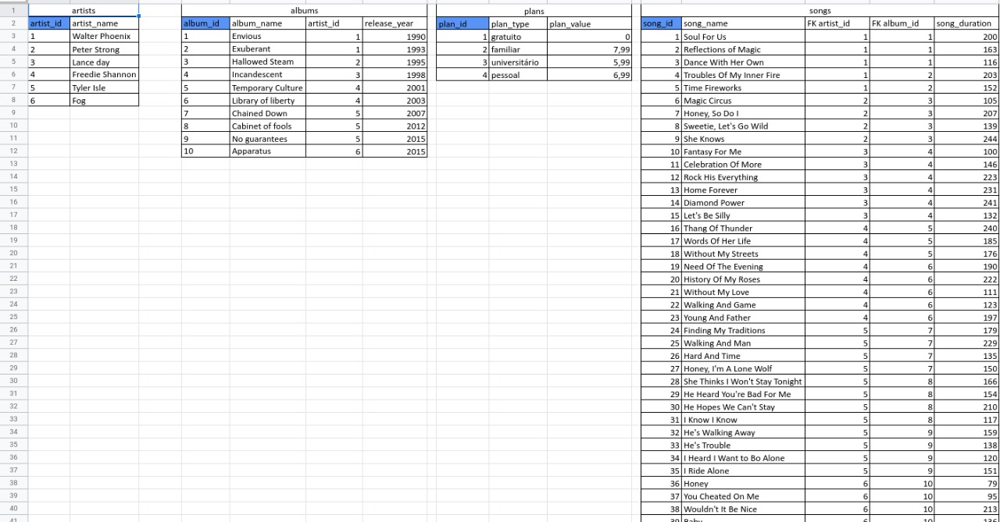
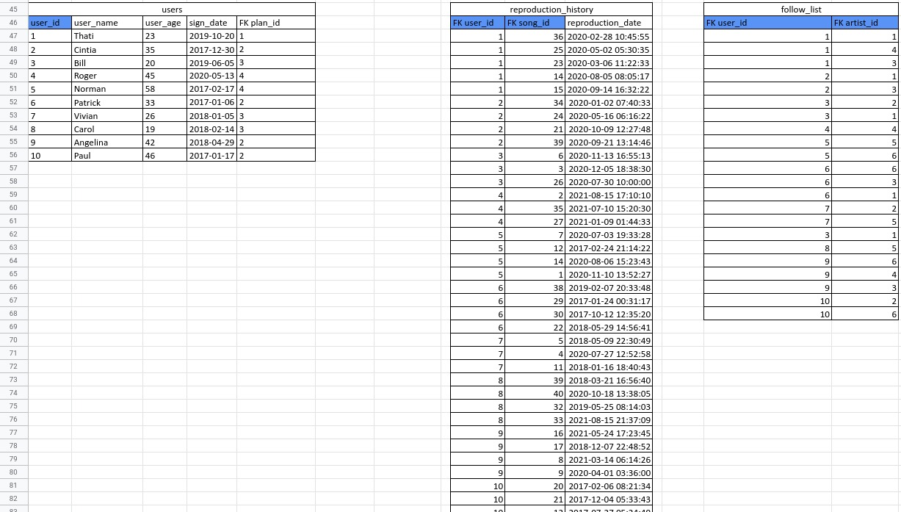

# Boas vindas ao repositório do projeto <b>MYSQL One For All</b>!

Esse projeto foi desenvolvido durante o módulo de Backend na Trybe! #vqv 

Aqui você vai encontrar os detalhes de como foi o desenvolvimento do projeto e quais foram os requisitos técnicos necessários para a entrega do desafio.

---

# Habilidades desenvolvidas

Neste projeto, fui capaz de:

- Normalizar uma tabela inteira de acordo com a Terceira Forma Normal;
- Revisar e utilizar todos os conceitos já vistos em MYSQL;
- Utilizar INNER JOIN, GROUP BY, LIKE e funções como MIN, MAX, AVG, REPLACE e afins do MySQL.

---

# Normalização de Tabela no MYSQL

Nesse projeto, recebemos uma tabela não normalizada simulando uma "mini-Spotify". Os dados estavam dispostos de uma forma "randômica", de modo que não podiam ser consultados e/ou inseridos normalmente no banco de dados. Assim, tivemos que realizar toda a normalização seguindo a Terceira Forma Normal, conforme aprendemos. Abaixo segue um pequeno esboço de como foi feita essa normalização. Na primeira imagem, temos a tabela não normalizada, como a recebemos. Na segunda e terceira imagem, já contamos com a normalização e população da tabela realizada, considerando tabelas intermediárias e o uso de Primary Keys e Foreign Keys para sua construção.





Após toda a normalização da tabela, tivemos que criar o Banco de Dados no MySQL e realizar toda a população dele de acordo com os dados fornecidos nessa planilha, com o uso de comandos como CREATE TABLE e INSERT INTO. Vocẽ pode acessar o arquivo com a tabela não normalizada e sua normalização [aqui](https://docs.google.com/spreadsheets/d/1-OUTrruCH4EKDaO8d7BYLf9NWlXiD5ZCcjmWB9SvoLg/edit?usp=sharing).

---

# Funcionamento da aplicação

Para iniciar o projeto, é necessário possuir o [Docker](https://docs.docker.com/engine/install/ubuntu/) e o [MySQL Workbench](https://dev.mysql.com/downloads/workbench/) instalados no computador.

O projeto trata-se de um desafio para consolidar nosso aprendizado com normalização de tabelas, criação de tabelas com inserção de dados no MySQL e também a utilização de JOINs e demais comandos do MySQL para realizar buscas em nosso banco de dados.

Após clonar o projeto em seu computador, para iniciá-lo é necessário executar o comando
```
docker-compose up -d && docker exec -it one_for_all bash
```
e na sequência
```
npm install
```

na pasta raíz do projeto. Isso fará com que os containers docker sejam orquestrados e a aplicação esteja disponível. Após isso, será necessário restaurar o banco de dados `SpotifyClone` para rodar os comandos.

<br>

<details>
  <summary><strong>🗒️ Instruções para restaurar o banco de dados `SpotifyClone`</strong></summary><br />

1. Faça o download do arquivo de backup [aqui](desafio1.sql) clicando em "Raw", depois clicando com botão direito e selecionando "Salvar como" para salvar o arquivo em seu computador.
2. Abra o arquivo com algum editor de texto e selecione todo o conteúdo do arquivo usando `CTRL-A`.
3. Abra o MySQL Workbench.
4. Crie uma conexão local no MySQL Workbench utilizando o hostname `localhost`, a porta `3306`, o usuário `root` e a senha `password`.
5. Abra uma nova janela de query e cole dentro dela todo o conteúdo do arquivo `desafio1.sql`.
6. Selecione todo o código com o atalho `CTRL-A` e depois clique no ícone de raio para executar a query.

    
7. Aguarde alguns segundos (espere em torno de 30 segundos antes de tentar fazer algo).
8. Clique no botão apontado na imagem a seguir para atualizar a listagem de banco de dados.

    

</details>

<br>

Feita a restauração do banco, você pode executar as _queries_ descritas em cada arquivo `desafioN.sql` desse projeto.

<br> 

---

# Histórico de Commits

É possível verificar todo o histórico de commits do projeto, de modo a visualizar passo-a-passo como foi desenvolvido o meu raciocínio até a finalização do projeto.

---

# Requisitos técnicos do desafio:

- ✅ 1. Crie um banco com o nome de SpotifyClone.

- ✅ 2. Crie uma `query` que exiba três colunas: total de canções, quantidade total de artistas e quantidade de álbuns.

- ✅ 3. Crie uma `query` que deverá ter apenas três colunas: exibir a pessoa usuária, a quantidade de músicas ouvidas pela pessoa usuária e a soma dos minutos ouvidos pela pessoa usuária.

- ✅ 4. Crie uma `query` que deve mostrar as pessoas usuárias que estavam ativas no ano de 2021 se baseando na data mais recente no histórico de reprodução.

- ✅ 5. Crie uma `query` que possua duas colunas: o nome da canção e a quantidade de pessoas que já escutaram ela.

- ✅ 6. Crie uma `query` que deve exibir quatro dados: o menor valor de plano para uma pessoa usuária, o maior valor de plano para uma pessoa usuária, o valor médio dos planos para uma pessoa usuária e o valor total obtidos com os planos possuídos por pessoas usuárias.

- ✅ 7. Crie uma `query` com as seguintes colunas: nome da pessoa artista, nome do álbum e a quantidade de pessoas seguidoras que aquela pessoa artista possui.

- ✅ 8. Crie uma `query` que o retorno deve exibir as seguintes colunas: nome da pessoa artista e nome do álbum.

- ✅ 9. Crie uma `query` que exibe a quantidade de músicas que estão presentes atualmente no histórico de reprodução de uma pessoa usuária específica. Para este caso queremos saber quantas músicas estão no histórico do usuário "Bill".

- ✅ 10. Crie uma `query` que exiba o nome e a quantidade de vezes que cada canção foi tocada por pessoas usuárias do plano gratuito ou pessoal.

- ✅ 11. Crie uma `query` que altere o nome de algumas músicas e as ordene em ordem alfabética.